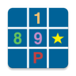

# PeterSoftware

* Free, no Ads and no any hidden charges.
* Doesn't collect user data
* Run without internet

## AzureNum

The AzureNum is a simplistic design Sudoku game. It offer clean and refreshing Sudoku gaming experience, also gives you the ability to create a Sudoku PDF file which could be printed or shared.

Check out on [Google Play](https://play.google.com/store/apps/details?id=com.peter.azure) 

## 上岸单词

一款免费，无需网络，无广告和没有任何收费陷阱的单词学习软件。上岸单词适合初中到大学英语（四六级）或者托福雅思考试的单词部分学习。功能有单词学习，搜索，音标列表，词缀表格，笔记。

Check out on [Google Play](https://play.google.com/store/apps/details?id=com.peter.landing) 
